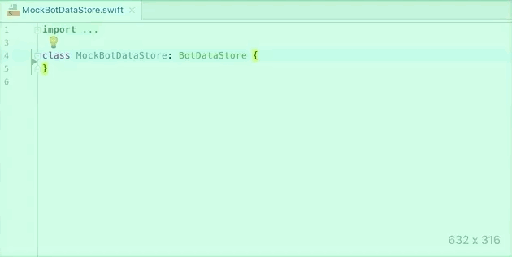

# MockGenerator

A plugin for AppCode to generate mock classes automatically.



## Installation

- Open AppCode
- Open AppCode → Preferences `⌘,`
- Go to Plugins
- Click Browse repositories...
- Search for 'Swift Mock Generator for AppCode'
- Click Install
- Restart AppCode

## Usage

- Create a mock class inheriting from from protocol(s) you would like to mock.
- With the cursor inside the class declaration, press `alt ↩`.
- Select 'Generate mock'.
- To regenerate the mock, place the cursor anywhere inside the mock and select 'Generate mock' again.

## Example

```
protocol Animator {
  func animate(duration: TimeInterval, animations: () -> (), completion: (Bool) -> ()) -> Bool
}

class MockAnimator: Animator {
  <generate mock from here>
}

class Object {

  var animator: Animator = ...

  func methodToTest() { ... }
}
```

### Create the mock object

```
let mockAnimator = MockAnimator()
```

### Inject the mock

```
let objectUnderTest = Object()
objectUnderTest.animator = mockAnimator
```

### Stub return value

Provide the mock with a return result and it will return it.

```
mockAnimator.stubbedAnimateResult = true
```

### Stub closure parameters

Closures without parameters are executed automatically so no need to stub the `animations` closure.

Closures with parameters will not be executed unless you provide their values.

```
mockAnimator.stubbedAnimateCompletionResult = true
```

### Perform the test
```
objectUnderTest.methodUnderTest()
```

### Query invocations

```
XCTAssert(mockAnimator.invokedAnimate)
```

### Query parameters

```
XCTAssertEqualWithAccuracy(mockAnimator.invokedAnimateParameters.duration, 0.25, accuracy: 0.01)
```

## Features

- Captures invocation status of a method.
- Captures invoked method parameters.
- Stub values for your mocks to return.
- Automatically calls closure parameters with stubbed values.
- Supports mocks conforming to one or or many protocols.
- Handles overloaded method declarations.
- Regenerate your mock in one action.
- Supports associated types.
- Respects public mocks and makes queries publicly available.
